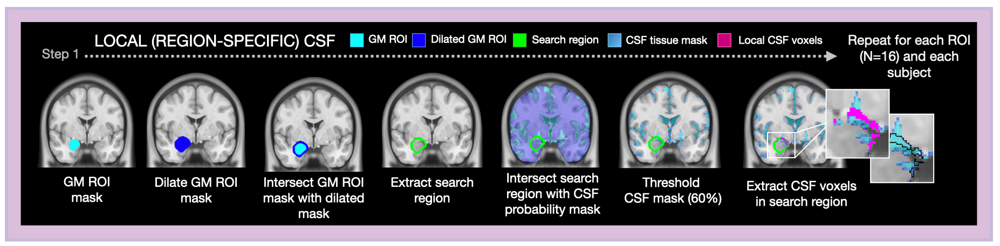
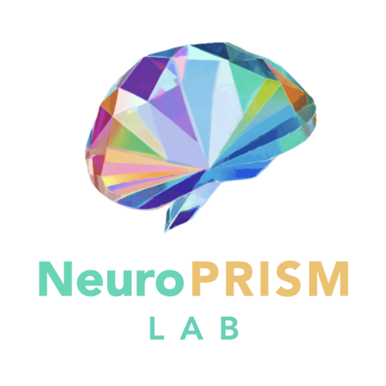

# Local CSF Correction Pipeline for fMRI
[](https://doi.org/10.5281/zenodo.15236635)

A modular pipeline for correcting CSF-related artifacts in subcortical fMRI to improve signal sensitivity and reduce physiological confounds in ultra-high field (7T) imaging.




---
## Purpose

Subcortical regions are vulnerable to noise due to low signal-to-noise ratio (SNR), small size, and proximity to CSF <sup>[1, 2]</sup>. Standard CSF correction averages signals across anatomically distinct CSF compartments, which can miss region-specific noise and reduce sensitivity.

To overcome these challenges, this pipeline introduces a localized CSF correction strategy that is region-specific, extracting and modeling CSF signals found directly adjacent to each subcortical ROI.

> For an overview of initial findings and methodological validation, see [supporting material](images/CNS_poster_2025.jpeg).


---
## Repository Structure
```
local_csf_pipeline/
├── pipeline.py             # Main script to run the full pipeline
├── config.py               # Paths, constants, and default variables
├── requirements.txt        # Python dependencies
├── README.md               # Project overview and usage
└── utils/                  # Utility functions grouped by functionality
    ├── __init__.py
    ├── process_roi.py      # ROI loading, resampling, thresholding, dilation
    ├── extract_csf.py      # Local CSF mask extraction and time series
    └── func_timeseries.py  # Functional time series extraction and regression
```
--- 
## Input Requirements
This pipeline is designed to be used with preprocessed fMRI data (e.g., from [fMRIPrep](https://fmriprep.org/)).

To run the pipeline, you will need the following inputs:

- **Preprocessed BOLD images** (NifTI)
    > Ex: `'sub-*_task-rest_run-01_bold_space-MNI152NLin2009cAsym_preproc.nii.gz'`

- **Confound files** (TSV) 
    > Ex: `'sub-*_task-rest_run-01_bold_confounds.tsv'`

- **CSF probability tissue masks** (NifTI)
    > Ex: `'sub-*_T1w_space-MNI152NLin2009cAsym_class-CSF_probtissue.nii.gz'`

- **MNI template** (NifTI)
    > Ex: `'mni_icbm152_t1_tal_nlin_asym_09c.nii.gz'`

- **ROI masks**
    > Ex: [Harvard-Oxford Atlas](https://nilearn.github.io/dev/modules/description/harvard_oxford.html/)
---
## Configuration 
Edit `config.py` to customize:
- `SUBJECT_ID`: Subject ID from the `SUBJ` environment variable  
- `BASE_DIR`, `DATA_DIR`, `ROI_DIR`, `OUTPUT_DIR`: Path configuration  
- `TEMPLATE_PATH`: MNI template for ROI resampling
- `DEFAULT_ROIS`: ROIs to include in the pipeline  
- `DEFAULT_REST_RUNS` *(optional)*: List of run labels
    > Ex: `['run-01', 'run-02', 'run-03']`
- `CONDITION` *(optional)*: Scan label
    > Ex: `'rest'` 
- `DEFAULT_MOTION_CONFOUNDS` *(optional)*: Motion regressors used in nuisance regression
    > Ex: `['X', 'Y', 'Z', 'RotX', 'RotY', 'RotZ']`
---
## Modules Overview
Each step in the pipeline is handled by a modular function located in the `/utils` folder.

### ROI Processing (`process_roi.py`)
- `initialize_roi_dict` – Creates a dictionary of available ROIs
- `process_roi_mask` – Loads and resamples ROIs to MNI space
- `threshold_roi_mask` – Binarizes probabilistic ROI masks
- `dilate_binary_roi_mask` – Expands binary ROIs outward to define a local search region

### CSF Extraction (`extract_csf.py`)
- `extract_local_csf_mask` – Identifies CSF voxels within the dilated mask but outside the gray matter ROI
- `extract_local_csf_time_series` – Extracts average local CSF time series from the functional image
- `add_local_csf_time_series_to_confound_file` – Appends local CSF regressors to fMRIPrep confounds

### Time Series Correction (`func_timeseries.py`)
- `compute_functional_timeseries` – Applies nuisance regression and returns cleaned functional signals

> See the example notebook `example_pipeline_demo.ipynb` for a step-by-step walkthrough.
---
## Input and Output Summary by Function
The following table outlines the step-by-step input files and corresponding output files generated by each function in the local CSF processing pipeline, organized by module.

| Step | Function                                         | Module              | Input(s)                                                                                                                      | Output(s)                                                                                     |
|------|--------------------------------------------------|---------------------|-------------------------------------------------------------------------------------------------------------------------------|------------------------------------------------------------------------------------------------|
| 1    | `process_roi_mask()`                            | `process_roi.py`    | <ul><li>ROI mask (`R_amygdala.nii.gz`)</li><li>Template (`mni_icbm152_t1_tal_nlin_asym_09c.nii.gz`)</li></ul>                | <ul><li>Resampled ROI mask (`R_amygdala_mask_proc.nii.gz`)</li></ul>                  |
| 2    | `threshold_roi_mask()`                          | `process_roi.py`    | <ul><li>Resampled ROI mask</li></ul>                                                                                          | <ul><li>Binary ROI mask (`R_amygdala_mask_binary.nii.gz`)</li></ul>                   |
| 3    | `dilate_binary_roi_mask()`                      | `process_roi.py`    | <ul><li>Binary ROI mask</li></ul>                                                                                             | <ul><li>Dilated ROI mask (`R_amygdala_mask_dilated.nii.gz`)</li></ul>                 |
| 4    | `extract_local_csf_mask()`                      | `extract_csf.py`    | <ul><li>Binary ROI mask</li><li>Dilated ROI mask</li><li>CSF tissue mask (`sub-*_class-CSF_probtissue.nii.gz`)</li></ul>         | <ul><li>Local CSF mask (`sub-*_R_amygdala_local_csf_mask.nii.gz`)</li></ul>                 |
| 5    | `extract_local_csf_time_series()`               | `extract_csf.py`    | <ul><li>Local CSF mask</li><li>Functional BOLD image (`sub-*_bold_space-MNI152NLin2009cAsym_preproc.nii.gz`)</li></ul>           | <ul><li>Local CSF time series (`sub-*_R_amygdala_local_csf_ts.csv`)</li></ul> |
| 6    | `add_local_csf_time_series_to_confound_file()`  | `extract_csf.py`    | <ul><li>Confound file (`sub-*_bold_confounds.tsv`)</li><li>Local CSF time series</li></ul>                                       | <ul><li>Modified confound file (`sub-*_bold_confounds_mod.tsv`)</li></ul>                         |
| 7    | `compute_functional_timeseries()`               | `func_timeseries.py`| <ul><li>Functional BOLD image</li><li>Binary ROI mask</li><li>Modified confound file</li></ul>                                | <ul><li>ROI-corrected time series (`sub-*_R_amygdala_corrected_ts.csv`)</li></ul> |


---
## Output Directory Structure
Each subfolder corresponds to a step in the pipeline.
```
output/
├── 1.proc_roi/         # Resampled ROI masks
├── 2.thresh_roi/       # Thresholded binary ROI masks
├── 3.dilated_roi/      # Dilated ROI masks
├── 4.local_csf_mask/   # Extracted local CSF masks
├── 5.local_csf_ts/     # Local CSF time series
├── 6.mod_confounds/    # Confounds with CSF appended
└── 7.corrected_ts/     # Final denoised ROI time series

```
---
## Dependencies
The pipeline requires the following Python packages (see `requirements.txt`):

- `numpy==2.0.2`
- `pandas==2.2.3`
- `nibabel==5.3.2`
- `nilearn==0.10.4`
- `scipy==1.13.1`

To install the required packages:
```bash
pip install -r requirements.txt
```
---
## Data Notes
> *Note: The pipeline was developed and tested on preprocessed 7T fMRI data (resting-state fMRI: N = 81; task-fMRI: N = 39), acquired at* **1.1 mm isotropic resolution** *with a* **TR of 2.34 seconds** *.*
> For details on the MRI acquisition protocol, see [Fischbach et al., 2024](https://www.jneurosci.org/content/44/26/e1757232024/tab-article-info).

While the code is resolution-independent, results may vary depending on voxel size and temporal resolution.

---
## References 
<sup>[1]</sup> Brooks, J. C. W. P., Faull, O. K., Pattinson, K. T. S. Dp. F., & Jenkinson, M. P. (2013). *Physiological Noise in Brainstem fMRI*. Frontiers in Human Neuroscience, 7. https://doi.org/10.3389/fnhum.2013.00623

<sup>[2]</sup> Sclocco, R., Beissner, F., Bianciardi, M., Polimeni, J. R., & Napadow, V. (2018). *Challenges and opportunities for brainstem neuroimaging with ultrahigh field MRI*. NeuroImage, 168, 412–426. https://doi.org/10.1016/j.neuroimage.2017.02.052

---
## License 
This project is licensed under the terms of the MIT License. This means you can freely use, modify, and distribute the code, as long as you provide attribution to the original authors and source.

---
## Changelog
### v1.0.0 — April 16, 2025
- First public release of the **Local CSF Correction Pipeline**
---
## Citation 
If you use this pipeline in your work, please cite:

Fischbach, A.K., & Noble, S. (2025). *Local CSF Correction Pipeline for fMRI* (Version 1.0.0) [Computer software]. Zenodo. https://doi.org/10.5281/zenodo.15236635

[](https://doi.org/10.5281/zenodo.15236635)

> Note: For full citation metadata, see the [CITATION.cff](https://github.com/AlexFischbach/local_csf_pipeline/blob/main/CITATION.cff) file included in this repository.
---
## Contributions 
- **Alexandra Fischbach, M.S., Ph.D. Candidate** <sup>1,2</sup> — Conceptualization, Method Development, Software Implementation, Documentation

- **Stephanie Noble, Ph.D.** <sup>1,2,3</sup> — Project Supervision, Conceptual Guidance, Methodological Oversight

<sub><sup>[1]</sup>Department of Psychology, Northeastern University

<sub><sup>[2]</sup>The Center for Cognitive and Brain Health, Northeastern University

<sub><sup>[3]</sup>Department of Bioengineering, Northeastern University

---
## About the Developer  
This pipeline was developed by **Alexandra Fischbach**, a 5th year Ph.D Candidate (expected Fall 2025), in the *Neuroscience Precision Research & Idiographic Statistical Methods* [(NeuroPRISM)](https://neuroprismlab.github.io/) Lab at Northeastern University, under the mentorship of **Dr. Stephanie Noble**.

For questions, feedback, or collaboration inquiries: fischbach.a@northeastern.edu

<div style="position: absolute; top: 4px; right: 4px;">
  
</div>

